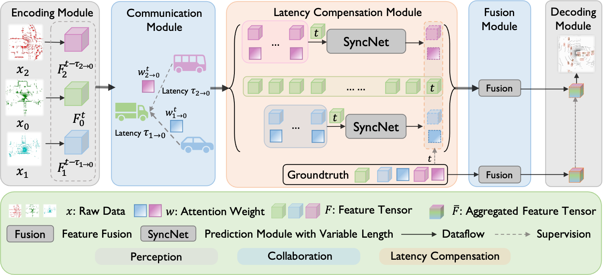
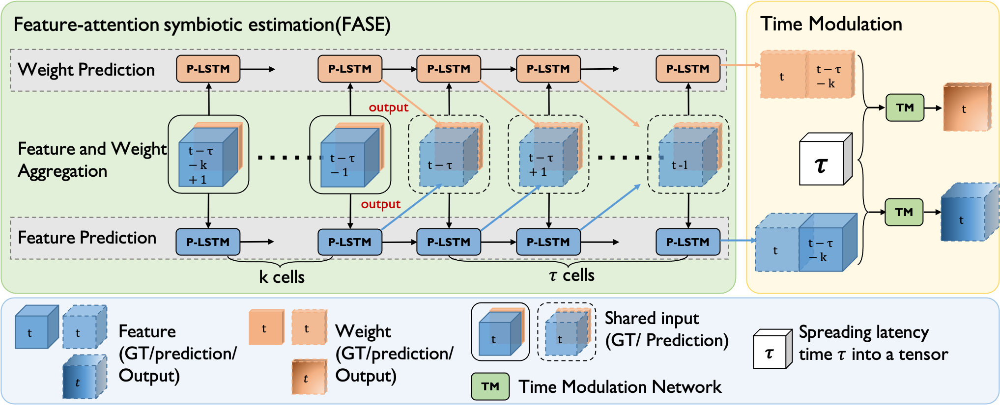

# SyncNet
[ECCV2022] Latency-Aware Collaborative Perception
<div>			<!--块级封装-->
    <center>	<!--将图片和文字居中-->
    
    <br>		<!--换行-->
    Backbone of our latency-aware collaborative perception system	<!--标题-->
    </center>
</div>

# Abstract
Collaborative perception has recently shown great potential to improve perception capabilities over single-agent perception. Existing collaborative perception methods usually consider an ideal communication environment. However, in practice, the communication system inevitably suffers from latency issues, causing potential performance degradation and high risks in safety-critical applications, such as autonomous driving. To mitigate the effect caused by the inevitable latency, from a machine learning perspective, we present the first latency-aware collaborative perception system, which actively adapts asynchronous perceptual features from multiple agents to the same time stamp, promoting the robustness and effectiveness of collaboration. To achieve such a feature-level synchronization, we propose a novel latency compensation mod- ule, called SyncNet, which leverages feature-attention symbiotic estimation and time modulation techniques. Experiments results show that the proposed latency aware collaborative perception system with SyncNet can outperforms the state-of-the-art collaborative perception method by 15.6% in the communication latency scenario and keep collaborative per-ception being superior to single agent perception under severe latency.

# SyncNet Architecture

<div>			<!--块级封装-->
    <center>	<!--将图片和文字居中-->
    
    <br>		<!--换行-->
    Architecture of our SyncNet	<!--标题-->
    </center>
</div>


## How to use


### 1: clone coperception repository.

```git
git clone https://github.com/coperception/coperception.git
```

### 2: Install coperception

Follow the README of the coperception repository and install detectron2.

### 3: Adjust path

1. Replace models, dataset, det and utils with our code in coperception.
2. Copy LA-det to tools.

### 4: Create data

Run LA-det/create_data_LAdet.py. Follow the instruction given by V2X-Sim 2.0 dataset and coperception repository.

We apply the basic latency aware collaborative perception methods in the new version of V2X-Sim include RSU now, you can test with test_LA.sh and test_Baseline.sh with correct dataset path.
